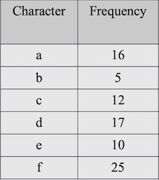
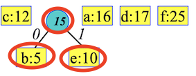
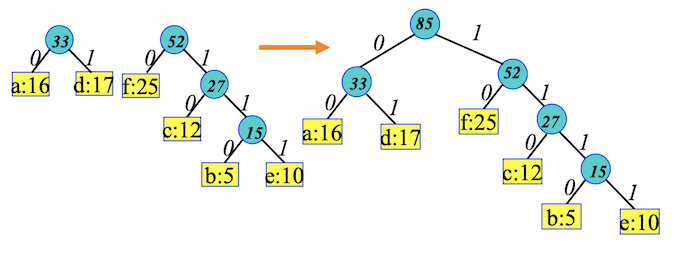

# Huffman Code
## 목차(Contents)

## You can answer
- Huffman Code란 무엇인가요?!
- 어떤 원리로 Huffman Code가 구현되나요?!

## Huffman Code란??
### Huffman Code(허프만 코드)
    무손실 압축에 쓰이는 엔트로피 부호화의 일종으로, 데이터 문자의 등장 빈도에 따라서 다른 길이의 부호를 사용하는 알고리즘이다.

## Huffman Code Algorithm 동작
### 동작
1. 초기화 : 모든 기호를 출현 빈도수에 따라 나열한다.
2. 단 한 가지 기호가 남을 때 까지 아래 단계를 반복한다.

        1. 목록으로부터 가장 빈도가 낮은 것을 2개 고른다.
        2. 그 다음 허프먼이 두가지 기호를 부모 노드를 가지는 부트리를 구성하고 자식노드를 생성한다. 부모 노드 단 기호들의 빈도수를 더하며 주 노드에 할당하고 목록의 순서에 맞도록 목록에 삽입한다.
        3. 목록에서 부모노드에 포함된 기호를 제거한다.

### 동작 예

- 다음과 같이 문자열의 빈도수가 주어졌다고 한다.
1. 빈도수별로 문자를 나열.

2. 목록으로부터 가장 빈도가 낮은 b와 e를 선택
3. b와 e를 자식으로 가지는 부모트리를 구성. 부모노드에는 b와 e의 빈도수를 더한 값을 할당 후 순서에 맞게 목록에 삽입.

4. 단 한 가지 기호가 남을 때 까지 아래 단계를 반복.

5. 빈도 수 별로 다른 길이의 부호가 결과로 나옴.

### 인코딩
트리의 결과에서 왼쪽 자식을 탐색할 때는 0, 오른쪽 자식을 탐색할 때는 1을 출력. 리프 노드를 만나면 리프 노드에 저장되어 있는 문자를 출력한다. 그렇게 하면 숫자가 출력된 후, 그 숫자에 해당하는 문자가 나오게 된다.

ex) 4,5단계의 그림을 참조하여 e를 탐색한다 했을때,
- 85노드에서 오른쪽(1)
- 52노드에서 오른쪽(1)
- 27노드에서 오른쪽(1)
- 15노드에서 오른쪽(1)
- 리프노드 도달.
- 1111에 해당되는 문자 e 출력.

### 디코딩
특정 숫자가 주어졌을 때 허프만 트리를 이용해서 주어진 숫자를 순서대로 하나씩 0이면 왼쪽 자식 Node를 탐색, 1이면 오른쪽 자식 Node를 탐색한다. 주어진 숫자를 끝까지 다 순회했을 때, 해당 노드에 저장된 알파벳이 디코딩 된 문자이다.

ex) 4,5단계의 그림을 참조하여 110이 주어졌을 때,
- 1 -> 85노드에서 오른쪽
- 1 -> 52노드에서 오른쪽
- 0 -> 27노드에서 왼쪽
- 해당 노드에 저장된 문자 : c

## BONUS
- Huffman Code 시간복잡도
    최소 값 추철에 logN의 시간을 소모한다. N개의 원소를 이용해 트리를 만들기 때문에 __O(NlogN)__ 의 시간 복잡도를 가진다.

---
## Reference
- [wkdtjsgur100](https://wkdtjsgur100.github.io/huffman/)

- [HuffmanCode개념](https://ko.wikipedia.org/wiki/%ED%97%88%ED%94%84%EB%A8%BC_%EB%B6%80%ED%98%B8%ED%99%94)
