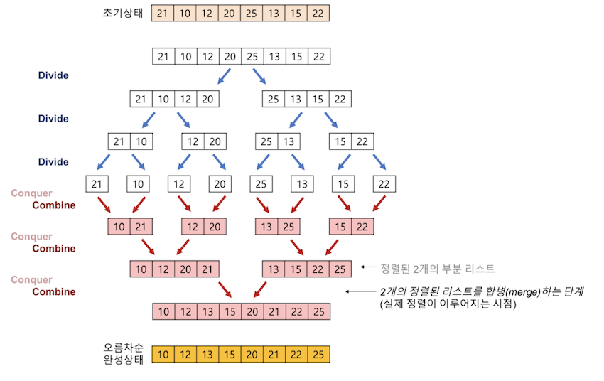
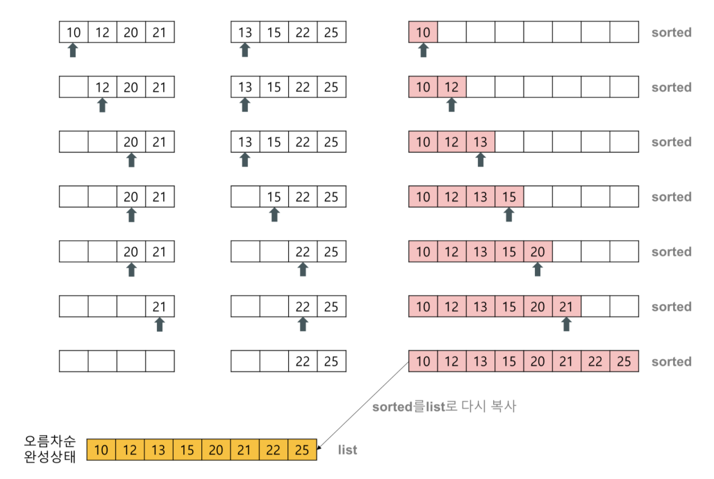

# Merge Sort

## 목차
- Merge Sort란?!
- Merge Sort의 동작과정
- Merge Sort의 사간복잡도
<!-- 어떤 질문을 대답할 수 있어야 하는지-->
## You can answer
- Merge Sort는 무엇인가요?
- Merge Sort의 시간복잡도는 어떻게 되나요?!
- Merge Sort의 장,단점은 무엇인가요?!
- Merge Sort는 어떻게 정렬이 되나요?!

---
## Merge Sort란?!
### Merge Sort(합병정렬 or 병합정렬)
- 존 폰 노이만이 1945년에 개발한 분할 정복 알고리즘의 하나인 __비교 기반 정렬 알고리즘.__

### Merge Sort의 특징 및 장단점.
- 특징

    + 병합해놓은 리스트를 원본에 복사하는 과정 등이 필요하기 때문에 시간이 오래 걸린다.
    + QuickSort와 다르게 pviot(기준)값이 없고 항상 데이터를 반으로 나누어 정렬을 진행.

- 장점

    + 정렬이 안정적이다.(무조건 절반으로 나눠서 정렬을 진행 하기 때문에 Quick Sort 처럼 pivot에 따라 성능이 안좋아지거나 하는 경우가 없다.)
    + 데이터 분포에 따른 시간 영향을 덜 받는다.(똑같은 크기로 나누어 정렬되기 때문에 시간은 동일)
    + 배열을 linked list로 구현시, 인덱스만 변경되므로 데이터의 이동 및 복사를 하지 않아도 된다.
    + 크기가 큰 배열을 정렬할 경우 연결리스트를 사용한다면, 합병정렬은 가장 효율적이다.

- 단점

    + 배열로 구현할 경우 임시 배열이 필요하다.(또 다른 메모리 소모)
    + 크기가 큰 경우 많은 이동횟수가 필요하기 때문에 시간 낭비가 될 수 있다.

## Merge Sort 동작과정
- 분할(Devide) : 입력 배열을  같은 크기의 2개의 부분 배열로 분할한다.
- 정복(Conquer) : 부분 배열을 정렬한다. 재귀적으로 배열의 크기가 충분히 작을때 까지 반복한다.
- 결합(Combine) : 정렬된 부분 배열들을 하나의 배열에 합병한다. 합병 과정에서도 재귀적으로 호출하여 적용한다.

### 예제


1. 크기가 8인 배열[21,10,12,20,25,13,15,22]을 같은 크기(4)의 2개의 부분 배열로 분할.
2. 최소의 크기가 될 때까지 크기를 재귀적으로 나눔.
3. 최소의 크기가 됐을 때, 각 배열의 크기를 비교하여 병합.
4. 기존의 크기까지 병합을 재귀적으로 반복.
5. 오름차순 형태의 결과를 반환.

### 정렬된 2개의 리스트 병합과정

1. 두개의 리스트를 왼쪽에서부터 차례로 비교 후 작은 값을 새로운 리스트로 옮김.
2. 둘 중 하나가 끝날 때까지 이 1번과정을 반복한다.
3. 문약 둘 중 리스트가 먼저끝나게 되면 나머지 리스트 값들은 전부 새로운 리스트로 복사한다.(정렬된 값이기 때문에 끝나지 않은 리스트는 모두 큰값이 존재한다는 의미.)
4. 새로운 리스트를 기존 리스트로 옮긴다.

## Merge Sort 시간복잡도

### Pseudo Code 예시
```c++
    //비교하여 정렬 후 병합 하는 과정.(Conquer, Combine)
    void merge(int left, int right){
        int mid = (left + right)/2; // 같은 크기의 리스트로 나눌 인덱스.
        int i = left; // 2개준 나눈 리스트 중 왼쪽 리스트 시작 인덱스.
        int j = mid + 1; // 2개로 나눈 리스트 중 오른쪽 리스트 시작 인덱스.
        int k = left; // 정렬할 값을 복사할 새로운 리스트의 시작 인덱스.
        while(i <= mid && j <= right){
            //각 배열을 비교하며 작은값을 새로운 인덱스에 저장 후 각 인덱스 증가.(병합과정 1,2번에 해당)
            if(arr[i] <= arr[j])
                arr2[k++] = arr[i++];
            else
                arr2[k++] = arr[j++];
        }

        int tmp = i>mid ? j : i; // i가 먼저 비교가 끝났다면 tmp에 j를, 아닐 시에는 i를 할당.

        while(k<=right) // 비교가 끝나지 않은 리스트를 마저 리스트에 저장.(병합과정 3번에 해당)
            arr2[k++] = arr[tmp++];

        for(int i=left; i<=right; i++)// 비교가 끝난 뒤 새로운 리스트에 복사.(병합과정 4번에 해당)
            arr[i] = arr2[i];
    }
    //나누는 과정.(Devide)
    void paritition(int left,int right){
        int mid;
        if(left < right){
            mid = (left + right)/2; // 같은 크기의 리스트로 나눌 인덱스.
            parition(left, mid); // 왼쪽 리스트를 재귀적으로 호출.
            parition(mid + 1, right); // 오른쪽 리스트를 재귀적으로 호출.
            merge(left,right); // 재귀적으로 분할이 끝났다면 merge를 함수를 호출
        }
    }

```
### Merge Sort의 시간복잡도
3가지의 단계를 생각하여 시간 복잡도를 계산.
1. 왼쪽 합병정렬 = T(n/2)
2. 오른쪽 합병정렬 = T(n/2)
3. 합치는 단계 = O(n)

T(n) = 2*T(n/2) + O(n)

     = 2(2T(n/4) + O(n/2)) + O(n)
     = 4(2T(n/8 + O(n/4))) + 2O(n)
     ...
     = n*T(1) + log n x O(n)
     = n*O(1) + O(nlog n)
     = O(n) + O(nlog n)
     ∴ T(n) = O(nlog n)


---
## Reference
- [MergeSort 특징 및 장단점](https://sweetlog.netlify.app/algorithm/merge_sort/)
- [MergeSort예시 코드](https://dpdpwl.tistory.com/53)
