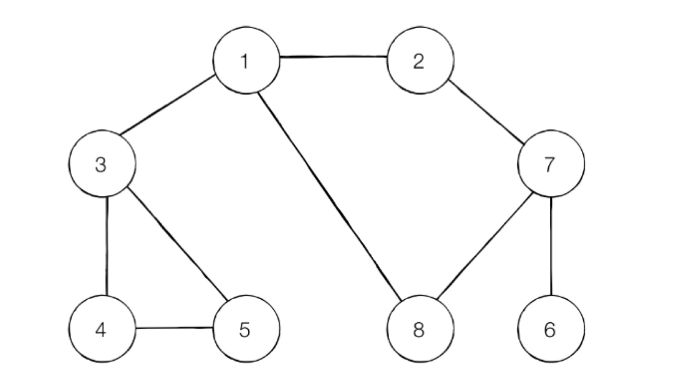
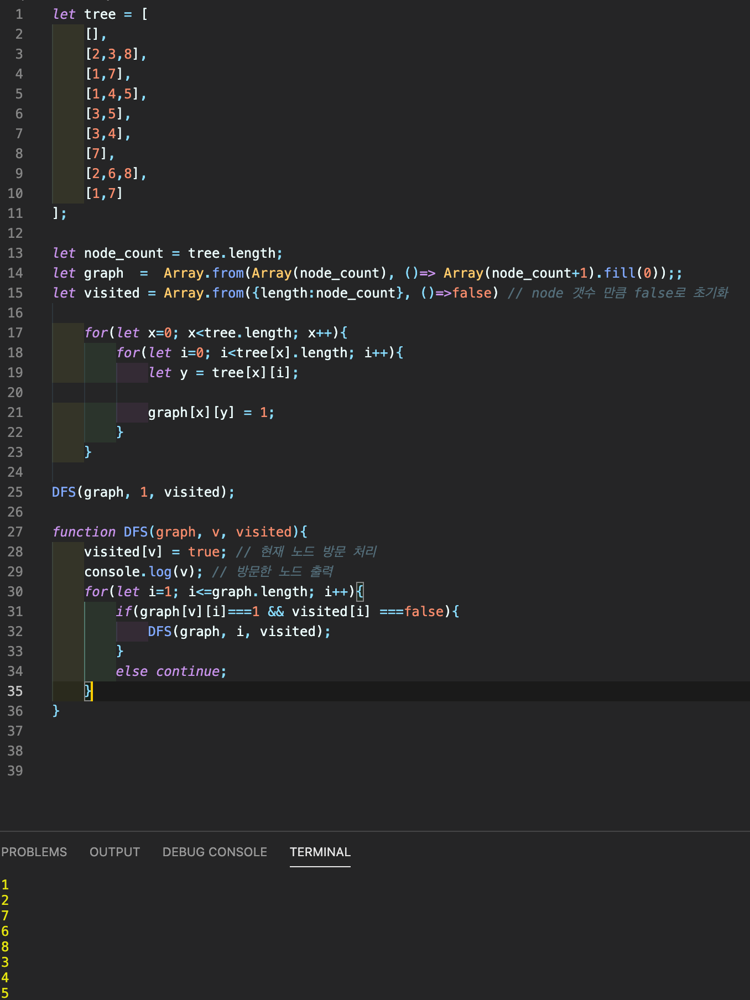

# What is DFS(:Depth-First Search)

## 정의
- 깊이 우선 탐색이라고도 부르며, 그래프에서 깊은 부분을 우선적으로 탐색하는 알고리즘
  
## 특징
- 스택 자료구조에 기초함
- 데이터의 개수가 N개인 경우 O(N)의 시간이 소요됨

---
## 예시

1. 시작 노드인 '1'을 스택에 삽입하고 방문 처리한다.
    
     [현재 스택] : 1

2. 스택의 최상단 노드인 '1'에 방문하지 않은 인접 노드 '2','3','8'이 있다.
   
   이 중에서 가장 작은 노드인 '2'를 스택에 삽입하고 방문 처리한다.

   [현재 스택] : 1, 2

3. 스택의 최상단 노드인 '2'에 방문하지 않은 노드 '7'이 있다.

    따라서 '7'을 스택에 삽입하고 방문 처리한다.

    [현재 스택] : 1, 2, 7

4. 스택의 최상단 노드인 '7'에 방문하지 않은 노드 '6', '8'이 있다.

    이 중에에서 가장 작은 노드인 '6'을 스택에 넣고 방문 처리를 한다.

    [현재 스택] : 1, 2, 7, 6

5. 스택의 최상단 노드인 '6'에 방문하지 않은 인접 노드가 없다. 스택에서 '6'을 꺼낸다.
   
   [현재 스택] : 1, 2, 7

6. 스택의 최상단 노드인 '7'에 방문하지 않은 노드 '8'이 있다.
   
   따라서 '8'을 스택에 넣고 방문 처리한다.

   [현재 스택] : 1, 2, 7, 8

7. 스택의 최 상단 노드인 '8'에 방문하지 않은 인접 노드가 없다. 스택에서 '8'을 꺼낸다.

    [현재 스택] : 1, 2, 7

8. 스택의 최상단 노드인 '7'에 방문하지 않은 인접 노드가 없다. 스택에서 '7'을 꺼낸다.

    [현재 스택] : 1, 2

9. 스택의 최상단 노드인 '2'에 방문하지 않은 인접 노드가 없다. 스택에서 '2'를 꺼낸다.

    [현재 스택] : 1

10. 스택의 최상단 노드인 '1'에 방문하지 않은 인접 노드 '3'을 스택에 넣고 방문 처리한다.

    [현재 스택] : 1, 3

11. 스택의 최상단 노드인 '3'에 방문하지 않은 인접 노드 '4', '5'가 있다.

    이 중에서 가장 작은 노드 '4'를 스택에 넣고 방문 처리한다.

    [현재 스택] : 1, 3, 4

12. 스택 최상단 노드인 '4'에 방문하지 않은 인접 노드 '5'가 있다. 

    따라서 '5'를 스택에 넣고 방문 처리한다.

    [현재 스택] : 1, 3, 4, 5

13. 남아 있는 노드에 방문하지 않은 인접 노드가 없다. 

결과적으로, 노드의 탐색 순서(스택에 들어간 순서)는 아래와 같다.

    1 >> 2 >> 7 >> 6 >> 8 >> 3 >> 4 >> 5

---
## 코드(JavaScript)
 Tip. 실제 구현은 재귀 함수를 이용하면 매우 간결하게 할 수 있다.

 

   
   

