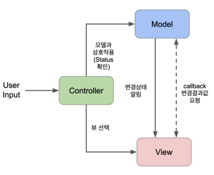

# MVC
<!--Table of Contents-->
- MVC 란?
    - 정의
- MVC 처리과정
- MVC 장단

<!-- 어떤 질문을 대답할 수 있어야 하는지-->
## You can answer
- MVC 란 무엇인가요 ?

<!--Contents-->

---
## MVC 란?
- 정의
  * Android Architecture Pattern 중 하나로 Model, View, Controller 세 가지의 구성요소로 나뉜다.

- Model
  * 어플리케이션에서 사용되는 데이터와 그 데이터를 처리하는 비즈니스 로직을 갖고 있는 부분이며, View나 Controller에 독립적이기 때문에 재사용이 가능합니다.

- View
  * 사용자에게 보여지는 UI부분으로 안드로이드에서는 XML에 해당합니다.

- Controller
  * 사용자의 입력에 따라 해당하는 모델에 따라 뷰를 선택하는 부분으로 안드로이드에서는 Activity나 Fragment에 해당합니다.

## MVC 처리과정
  
  ### 처리 순서
  * Controller로 사용자 입력이 들어온다.
  * Controller는 사용자의 입력에 따라 Model로부터 데이터 업데이트 필요한지 확인한다.
  * Controller는 Model을 나타내줄 View 선택한다.
  * View는 Model에서 실제 필요한 데이터를 받아와 View를 업데이트하여 화면을 나타낸다.

## MVC 특징
  - 장점
    * 안드로이드에서 구현하기 가장 쉽고 단순하며, 개발기간이 짧아진다.
    * Model과 View가 분리되어 있어 Model의 비종속성으로 인해 재사용이 가능하다.

  - 단점
    * Model과 View 사이에 의존성이 발생하여, 어플리케이션의 크기가 커지고 로직이 복잡해질수록 유지보수가 힘들어진다.
    * 시간이 지날수록 Controller에 많은 코드가 쌓여 코드 비대화로 인해 문제 발생이 가능성이 높다.
    * Controller가 안드로에드 API에 깊게 종속되므로 유닛테스트가 어렵다.

---
## Reference
- [안드로이드 아키텍처 패턴 - MVC가 뭘까?](https://velog.io/@jojo_devstory/%EC%95%88%EB%93%9C%EB%A1%9C%EC%9D%B4%EB%93%9C-%EC%95%84%ED%82%A4%ED%85%8D%EC%B3%90-%ED%8C%A8%ED%84%B4-MVC%EA%B0%80-%EB%AD%98%EA%B9%8C)
