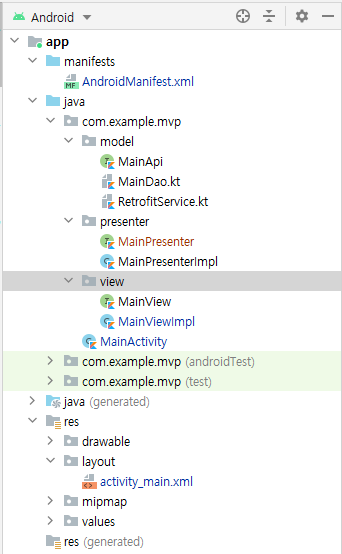

# MVP
<!--Table of Contents-->
- MVP 란?
- MVP 처리과정
- MVP 예제코드
- MVP 특징

<!-- 어떤 질문을 대답할 수 있어야 하는지-->
## You can answer
- MVP 란 무엇인가요 ?

<!--Contents-->

---
## MVP 란?
- 정의
  * Android Architecture Pattern 중 하나로 Model, View, Presenter 세 가지의 구성요소로 나뉜다.

- Model
  * 어플리케이션에서 사용되는 데이터와 그 데이터를 처리하는 비즈니스 로직을 갖고 있는 부분이다.
  * View나 Presenter에 독립적이기 때문에 재사용이 가능하다.

- View
  * 사용자에게 보여지는 UI부분으로 안드로이드에서는 Activity나 Fragment에 해당한다.
  * Model에서 처리된 데이터를 Presenter를 통해 받아서 사용자에게 보여준다.
  * Presenter를 이용해 데이터를 주고받기 때문에 Presenter에 매우 의존적이다.

- Presenter
  * Model과 View 사이의 매개체라는 점에서 MVC의 Controller와 유사하지만, View에 직접 연결되는 대신 인터페이스를 통해 상호작용한다는 점이 다르다.
  * View에게 표시할 내용(Data)만 전달하며 어떻게 보여줄지는 View가 담당한다.

## MVP 처리과정
  
  ### 처리 순서
  1) View로 사용자의 입력이 들어온다.
  2) View는 Presenter에 이벤트를 전달하며 작업을 요청한다.
  3) Presenter에서 필요한 데이터를 Model에 요청하고, Model은 요청된 데이터를 Presenter에 응답한다.
  4) Presenter는 View에게 데이터를 응답하고, View는 Presenter가 응답한 데이터를 이용하여 화면을 나타낸다.

## MVP 예제코드
  - MVP 패키지 구조  
  
  &nbsp;&nbsp; 위 패키지 구조와 같이 MVP는 interface를 사용하여 모듈화 하는 것이 특징이다.
  <br>

  - MainPresenter & MainPresenterImpl
  ```Kotlin
  interface MainPresenter {
    fun callItem(stationName: String)
}

class MainPresenterImpl(private val mainView: MainView) : MainPresenter {

    override fun callItem(stationName :String) {
        CoroutineScope(Dispatchers.IO).launch {
            try {
                val info = MainService.retrofitService.listAir(
                    BuildConfig.airKoreaKey,
                    "json",
                    2,
                    1,
                    stationName,
                    "DAILY",
                    1.0
                ).body()!!.response.body.items[0]
                mainView.showResult(info)
            } catch (e: Exception) {
                Log.e("network error", e.toString())
            }
        }
    }
}
  ```
  &nbsp;&nbsp; MVC의 Controller와 비슷하지만 View와 연결되는 것이 아닌, 단순히 interface라는 점이 특징이다.
  &nbsp;&nbsp; Presenter는 View에게 UI를 표시할 방법을 지시하는 것이 아닌 Model을 이용해 표시할 내용을 만들고 전달만 하는 역할을 맡는다.
  <br>
  - MainView & MainViewImpl & MainActivity  
  ```Kotlin
  interface MainView {
    fun showResult(item: item)
}

class MainViewImpl(private val binding : ActivityMainBinding) : MainView{
    override fun showResult(item: item) {
        binding.textTime.text = item.dataTime
        binding.pm10.text = item.pm10Value
        binding.pm10Grade.text = item.pm10Grade
    }
}

  class MainActivity : AppCompatActivity() {
    private val binding: ActivityMainBinding by lazy { ActivityMainBinding.inflate(layoutInflater) }
    private val mainPresenter: MainPresenter by lazy { MainPresenterImpl(MainViewImpl(binding)) }

    override fun onCreate(savedInstanceState: Bundle?) {
        super.onCreate(savedInstanceState)
        setContentView(binding.root)
        initListener()
    }

    private fun initListener() {
        binding.btnSearch.setOnClickListener {
            mainPresenter.callItem(binding.stationName.text.toString())
        }
    }
}
  ```
  &nbsp;&nbsp; View의 interface를 구현함으로써 Presenter는 특정 View와 결합할 필요 없이 가상의 View를 통해 간단한 유닛테스트가 가능해진다.
  <br>

## MVP 특징
  - 장점
    * MVC 와는 다르게 View와 Model의 의존성이 없기 때문에 유닛테스트가 용이하다.
    * Model 관련 처리들은 Presenter를 통해서 이루어지기 때문에 View는 Model에 대해 알 필요가 없다.

  - 단점
    * View와 Presenter가 1:1로 강한 의존성을 갖는다.
    * View가 늘어날 때 마다 추가되어야 하는 인터페이스와 클래스가 많아진다.

---
## Reference
- [안드로이드 아키텍처 패턴 - MVP가 뭘까?](https://velog.io/@jojo_devstory/%EC%95%88%EB%93%9C%EB%A1%9C%EC%9D%B4%EB%93%9C-%EC%95%84%ED%82%A4%ED%85%8D%EC%B2%98-%ED%8C%A8%ED%84%B4-MVP%EA%B0%80-%EB%AD%98%EA%B9%8C)

- [MVC, MVP, MVVM 예제 코드](https://github.com/rkdmf1026/AndroidArchitectureTest)
